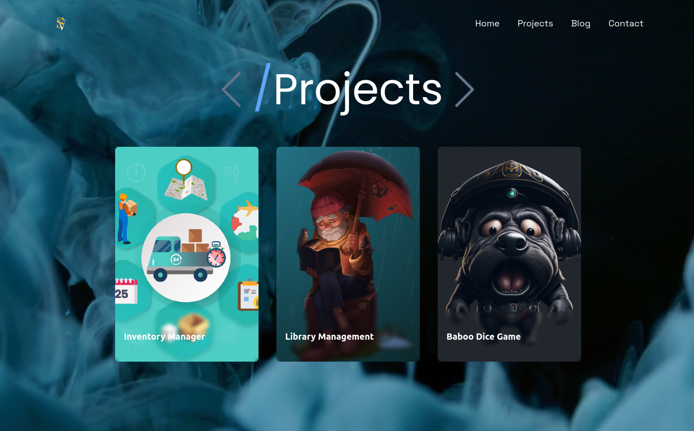

# Web Portfolio Project

This is a web portfolio project showcasing my skills, projects, and experience as a developer.
## [Click to see demo](https://vitaliisili.com)
## Table of Contents
Description
Features
Technologies Used
Installation
Usage
Screenshots
Contributing
License
Contact

## Description
This web portfolio project is created to display my work as a web developer and designer. It includes sections for my bio, skills, projects, and contact information. The purpose of this portfolio is to showcase my abilities, experience, and previous projects to potential clients or employers.

## Features
Responsive design for various devices and screen sizes.
Sections for bio, skills, projects, and contact information.
Interactive elements and smooth animations for enhanced user experience.
Project gallery with descriptions and links to deployed projects or GitHub repositories.
Contact form for users to get in touch with me directly.

## Technologies Used
- HTML5
- CSS3
- JavaScript
- ReactJS
- Tailwind
- Jenkins

## Usage
Modify the content of the files to personalize the portfolio according to your information and preferences.
Add your projects to the project gallery with appropriate descriptions and links.
Customize the styles and layout to match your personal branding.

### Contributing
Contributions are welcome! Please follow these steps:
Fork the project.
Create your feature branch: git checkout -b feature/new-feature
Commit your changes: git commit -m 'Add some feature'
Push to the branch: git push origin feature/new-feature
Submit a pull request.

## License
This project is licensed under the [License](License) - see the LICENSE.md file for details.

## Contact
Vitalii Sili

Portfolio: [Portfolio URL](https://vitaliisili.com)

LinkedIn: [LinkedIn Profile](https://www.linkedin.com/in/vitaliisili/)